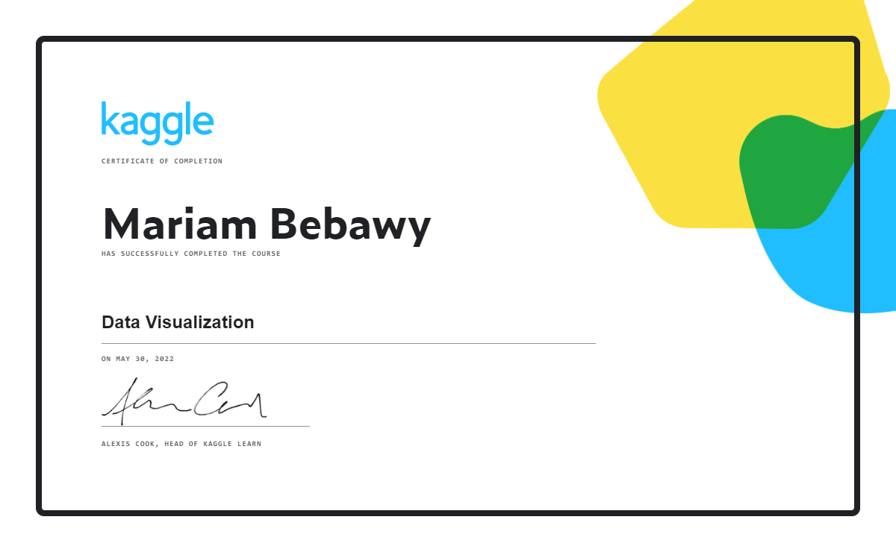

# KAGGLE_DataCleaning
Kaggle learning resources and tasks  
-- Data Cleaning
-- As required by Technocolabs Machine Leanring Internship Program

***
### Notebooks exercises:
1. [Hello, Seaborn](./02-01_hello-seaborn.ipynb)
2. [Line Charts](./02-02_line-charts.ipynb)
3. [Bar Charts and Heatmaps](./02-03_bar-charts-and-heatmaps.ipynb)
4. [Scatter Plots]()
5. [Distributions]()
6. [Choosing Plot Types and Custom Styles]()
7. [Final Project]()

***
### Certificate:

***
### Helpful links:
* https://www.kaggle.com/learn/data-visualization/